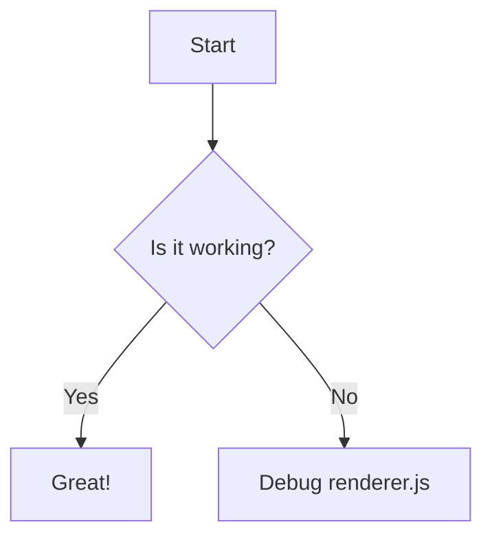

# Welcome to **SharePage**!

This is a sample note to demonstrate SharePage's markdown rendering capabilities. #test-tag #obsidian-share

## What is SharePage?

SharePage is a tool that allows you to share your Obsidian notes via GitHub Pages. It supports:

- **Markdown rendering** - Full markdown support with syntax highlighting
- **Internal links** - Navigate between notes using `[[note]]` syntax
- **Image support** - Display images with `![[image]]` syntax
- **MOC support** - Organize your notes with Map of Content files

## High-Contrast Bold Styling

In ShareHub, **bold text** is not just thick; it's **high-contrast**. This makes **important information** stand out immediately against the theme background. Whether you are in **Light Mode** or **Dark Mode**, the colors will **invert** to ensure **maximum visibility**.

## Code Examples

Here's some JavaScript code:

```javascript
function greet(name) {
  console.log(`Hello, ${name}!`);
  return `Welcome, ${name}`;
}

greet('ShareHub');
```

And some Python:

```python
def fibonacci(n):
    if n <= 1:
        return n
    return fibonacci(n-1) + fibonacci(n-2)

print(fibonacci(10))
```

## Links

Try navigating to the [[note-todo.md]] to see an example todo list!

## Lists

Here's an unordered list:
- First item
- Second item
- Third item

And an ordered list:
1. First step
2. Second step
3. Third step

## Blockquotes

> This is a blockquote.
> It can span multiple lines.
> 
> - Even with lists!

## Tables

| Feature | Status |
|---------|--------|
| Markdown rendering | ✅ |
| Internal links | ✅ |
| Images | ✅ |
| Code highlighting | ✅ |
| MOC support | ✅ |

## Image Test

Here's a test image:

![[test.jpg]]

### PNG Image
![[logo.png]]

## Mermaid Diagram Support

Here is a mermaid diagram to test rendering:



## Mathematical Formula Support (KaTeX)

Here are some math formulas to test Obsidian compatibility:

- **Inline Math**: The quadratic formula is $x = \frac{-b \pm \sqrt{b^2 - 4ac}}{2a}$.
- **Block Math**:
$$
e^{i\pi} + 1 = 0
$$

Another example with multiple lines:
$$
\begin{aligned}
\nabla \cdot \mathbf{E} &= \frac{\rho}{\varepsilon_0} \\
\nabla \cdot \mathbf{B} &= 0 \\
\nabla \times \mathbf{E} &= -\frac{\partial \mathbf{B}}{\partial t} \\
\nabla \times \mathbf{B} &= \mu_0\left(\mathbf{J} + \varepsilon_0\frac{\partial \mathbf{E}}{\partial t}\right)
\end{aligned}
$$
